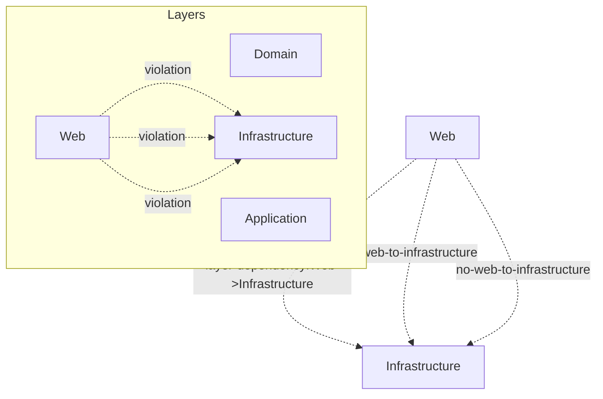

# RepoGraph Context Pack

Generated: 2026-05-20T06:11:41.302Z

## Project

- **Name:** CarRentalExample
- **Description:** Example Clean Architecture C# + Angular project
- **Architecture:** Clean Architecture
- **Primary language:** C#

## Modules

### Auth (critical)
Authentication and authorization

### Booking
Booking management

### Shared
Shared utilities

## Architecture Layers

- **Domain** (`src/Domain`): may depend on []
- **Application** (`src/Application`): may depend on [Domain]
- **Infrastructure** (`src/Infrastructure`): may depend on [Application, Domain]
- **Web** (`src/Web`): may depend on [Application]

## Architecture Violations

- [error] Layer "Web" must not depend on "Infrastructure". Allowed: [Application]
- [error] Web layer must not reference Infrastructure layer
- [error] Web must not directly depend on Infrastructure

## AI Instructions

- Follow Clean Architecture layer rules strictly
- Domain layer must not depend on any other layer
- Web layer must not access Infrastructure directly
- Always validate TenantId in multi-tenant operations

## Risk Warnings

- Auth module is critical - extra care required

## Stats

- Files scanned: 15
- Modules: 3
- Dependencies: 32
- Unmapped files: 4

## Layer Diagram

