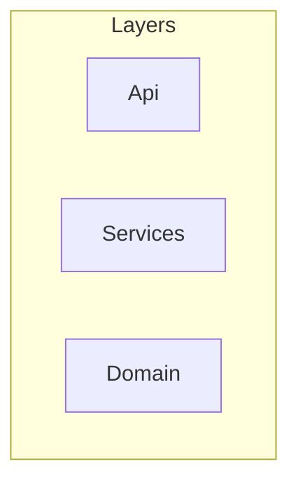

# RepoGraph Context Pack

Generated: 2026-05-20T11:43:40.770Z

## Project

- **Name:** NodeLayeredApi
- **Description:** Layered Node.js API example for RepoGraph
- **Architecture:** Layered
- **Primary language:** TypeScript

## Modules

### Orders (critical)
Order placement and retrieval

### Shared
Shared domain types

## Architecture Layers

- **Api** (`src/api`): may depend on [Services]
- **Services** (`src/services`): may depend on [Domain]
- **Domain** (`src/domain`): may depend on []

## AI Instructions

- Respect Api → Services → Domain layering
- Keep Orders module changes isolated

## Stats

- Files scanned: 3
- Modules: 2
- Dependencies: 2
- Unmapped files: 0

## Layer Diagram

